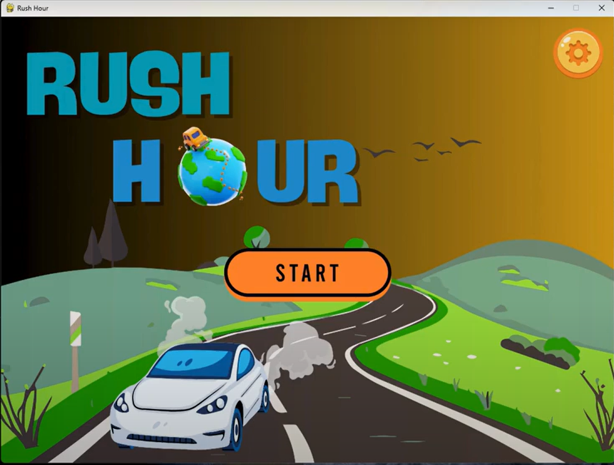

<a  id="readme-top"></a>

  

<!-- PROJECT SHIELDS -->

[![Contributors][contributors-shield]][contributors-url]

[![Forks][forks-shield]][forks-url]

[![Stargazers][stars-shield]][stars-url]

[![Issues][issues-shield]][issues-url]

  

<!-- PROJECT LOGO -->

<br />

<div  align="center">

<a  href="https://github.com/rtyud5/RushHourGame">

</a>

  

<h3  align="center">Rush Hour Solver with AI Search Algorithms</h3>

<p  align="center">

An intelligent puzzle solver for the classic Rush Hour game, using BFS, DFS, UCS, and A* search algorithms.

<br />

<a href="https://github.com/rtyud5/RushHourGame">View Demo</a>

<p align="center">
  
</p>

<a href="https://github.com/rtyud5/RushHourGame/issues/new">Report Bug</a>

·

<a href="https://github.com/rtyud5/RushHourGame/issues/new">Request Feature</a>

</p>

</div>

<details>

<summary>Table of Contents</summary>

<ol>

<li><a  href="#about-the-project">About The Project</a></li>

<li><a  href="#built-with">Built With</a></li>

<li><a  href="#getting-started">Getting Started</a></li>

<li><a  href="#usage">Usage</a></li>

<li><a  href="#roadmap">Roadmap</a></li>

<li><a  href="#contributing">Contributing</a></li>

<li><a  href="#contact">Contact</a></li>

<li><a  href="#acknowledgments">Acknowledgments</a></li>

</ol>

</details>

  

---

  

## About The Project

  

This project is an intelligent Rush Hour game solver built in Python with a Pygame GUI. It allows users to:

  

- Select one of 10 designed maps.

- Choose a search algorithm: BFS, DFS, UCS, or A*.

- Visualize the solving process in real-time with animations.

- View statistics: number of expanded nodes, time, memory usage, and solution length.

  

Developed as a group project for **CS14003 – Introduction to Artificial Intelligence**.

  

<p  align="right">(<a  href="#readme-top">back to top</a>)</p>

  

---

  

### Built With

  

- [Python 3](https://www.python.org/)

- [Pygame](https://www.pygame.org/)

- Custom-built search algorithms

  

<p  align="right">(<a  href="#readme-top">back to top</a>)</p>

  

---

  

## Getting Started

  

### Prerequisites

  

- Python 3.9 or higher

- Pygame

  

### Installation

  

1. Clone the repository:

```bash

   	git clone https://github.com/rtyud5/RushHourGame.git
   
   	cd RushHourGame

```

  

2. Install dependencies:

```bash

	pip install -r requirements.txt

```

  

3. Run the game:

```bash

	python src/main.py

```

  

<p  align="right">(<a  href="#readme-top">back to top</a>)</p>

  

---

  

## Usage

  

- Use the GUI to select a level and search algorithm.

- Click **Start** to visualize the algorithm solving the puzzle.

- Use **Pause**, **Reset**, or **Back** buttons for better control.

- Adjust settings like volume and view credits/help.

- Supports 10 built-in maps.

- Displays a dialog after finish.

  

<p  align="right">(<a  href="#readme-top">back to top</a>)</p>

  

---

  

## Roadmap

  

- ✅ BFS Solver

- ✅ DFS Solver

- ✅ UCS Solver (vehicle length = move cost)

- ✅ A* Search with blocking-vehicle heuristic

- ✅ Statistics tracking

- ✅ Interactive GUI (pause, reset, settings)

- ✅ Map loader (JSON format)

- 🔲 Custom map editor *(planned)*

  

<p  align="right">(<a  href="#readme-top">back to top</a>)</p>

  

---

  

## Contributing

  

Contributions are welcome!

  

1. Fork the project

2. Create a new feature branch:

```bash

	git checkout -b feature/AmazingFeature

```

3. Commit your changes:

```bash

	git commit -m 'Add AmazingFeature'

```

4. Push to the branch:

```bash

	git push origin feature/AmazingFeature

```

5. Open a Pull Request
```bash

	https://github.com/rtyud5/RushHourGame/pulls

  ```

<p  align="right">(<a  href="#readme-top">back to top</a>)</p>

  
## Contact

  

**Group Rush Hour AI** – [student.email@example.com](mailto:student.email@example.com)

Project Repository: [https://github.com/rtyud5/RushHourGame](https://github.com/rtyud5/RushHourGame)

  

<p  align="right">(<a  href="#readme-top">back to top</a>)</p>

  

---

  

## Acknowledgments

  

- University of Science – CS14003: Introduction to AI

-  *Rush Hour* puzzle by ThinkFun

- Wikipedia – [Rush Hour (puzzle)](https://en.wikipedia.org/wiki/Rush_Hour_(puzzle))

- CoKoGames – [Rush Hour Online](https://www.cokogames.com/rush-hour/)

  

<p  align="right">(<a  href="#readme-top">back to top</a>)</p>

  

<!-- MARKDOWN LINKS & IMAGES -->

[contributors-shield]: https://img.shields.io/github/contributors/rtyud5/RushHourGame.svg?style=for-the-badge
[contributors-url]: https://github.com/rtyud5/RushHourGame/graphs/contributors

[forks-shield]: https://img.shields.io/github/forks/rtyud5/RushHourGame.svg?style=for-the-badge
[forks-url]: https://github.com/rtyud5/RushHourGame/network/members

[stars-shield]: https://img.shields.io/github/stars/rtyud5/RushHourGame.svg?style=for-the-badge
[stars-url]: https://github.com/rtyud5/RushHourGame/stargazers

[issues-shield]: https://img.shields.io/github/issues/rtyud5/RushHourGame.svg?style=for-the-badge
[issues-url]: https://github.com/rtyud5/RushHourGame/issues

